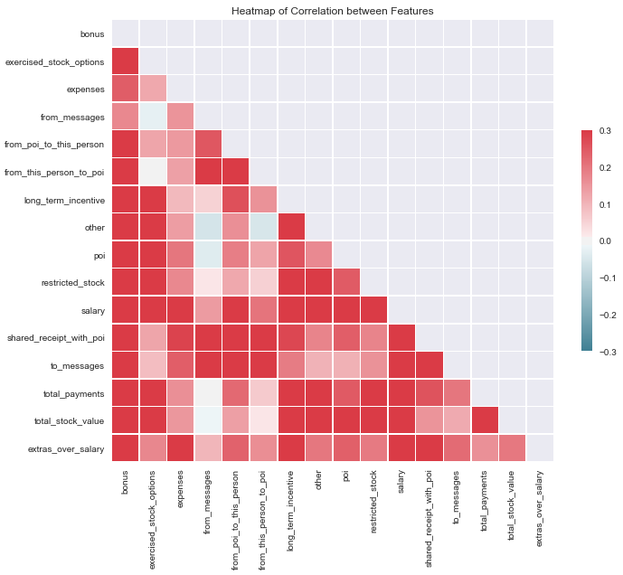
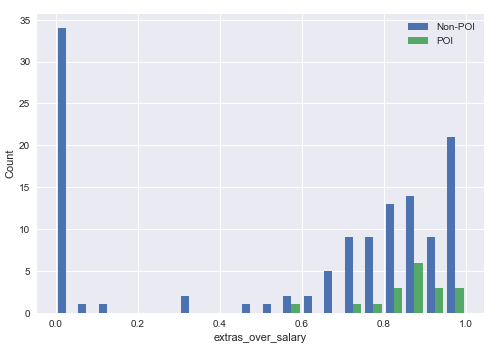
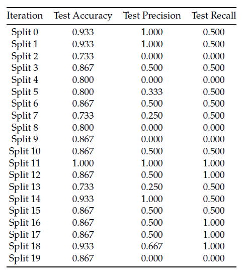

# Detecting Persons of Interest in Enron Dataset

**by Ananda Sales Ribeiro**

## 1 Introduction

This project objective is to determine if someone is a person of interest (POI) in the [case of fraud
of Enron Corporation](https://www.investopedia.com/updates/enron-scandal-summary/).

The dataset available contains e-mails and financial information of 145 Enron employees. It
was also already provided a list of which of them are POIs. The goal of this project is to identify if
a new employee (not listed in this dataset) is a POI or not, based on his financial and e-mail data.

This problem will be solved using Machine Learning techniques of supervised classification.
This technique will be very useful in this case, since several examples of POIs and non-POIs are
available. It will be possible to train an algorithm to classify a new individual into one of these
two classes depending on how similar his data are to the ones of the individuals in the dataset.

## 2 Dataset

The dataset contains the following financial data for each subject:  
bonus, salary, deferral_payments, deferred_income, director_fees, expenses, loan_advances,
long_term_incentive, other, total_payments, exercised_stock_options, restricted_stock, re-
stricted_stock_deferred, total_stock_value.

And the following e-mail data:  
email_address, from_messages, from_poi_to_this_person, from_this_person_to_poi,
shared_receipt_with_poi, to_messages.

That is a total of 20 features.  
Besides that, it also contains the label poi that identifies a person as POI or non POI.

### 2.1 Outliers

The dataset had originally 146 data points. It had information of 144 employees, the total financial
values for all employees and financial values of The Travel Agency in the Park.

The total of financial values was excluded from the dataset since it was the sum of all other
values.

The Travel Agency in the Park was an agency co-owned by Ken Lay’s sister and received
payments from Enron Employees for business-related travels. It only have values for two features:
other and total_payments. These data can’t be compared to the other individuals data, which are
personal. The data related to the Travel Agency in the Park will also be excluded from the dataset.

During the data exploration, some cases of outliers that appeared in the scatterplots were investigated:  
Case 1: Bonus above 6.000.  
Case 2: Expenses above 200.  
Case 3: From messages above 12500.  
Case 4: from_poi_to_this_person above 500.  
Case 5: Long term incentive above 5.000.  
Case 6: Negative restricted stock.  
Case 7: Other above 6.000.  
Case 8: To messages above 10000.  
Case 9: total_payments above 100.000.  
Case 10: total_stock_value above 40.000.  

The data of these cases were analyzed more closely.  

Most of them had no problems and despite being outliers, the data seem correct and they
should remain in the dataset. One example was Lay Kenneth, who was included in the cases 1, 7,
9 and 10. He is a POI and, consequently, of high interest for this investigation.

Only one case presented a problem: BHATNAGAR SANJAY.
’bonus’: ’NaN’,  
’deferral_payments’: ’NaN’,  
’deferred_income’: ’NaN’,  
’director_fees’: 137864,  
’email_address’: ’sanjay.bhatnagar@enron.com’,  
’exercised_stock_options’: 2604490,  
’expenses’: ’NaN’,  
’from_messages’: 29,  
’from_poi_to_this_person’: 0,  
’from_this_person_to_poi’: 1,  
’loan_advances’: ’NaN’,  
’long_term_incentive’: ’NaN’,  
’other’: 137864,  
’poi’: False,  
’restricted_stock’: -2604490,  
’restricted_stock_deferred’: 15456290,  
’salary’: ’NaN’,  
’shared_receipt_with_poi’: 463,  
’to_messages’: 523,  
’total_payments’: 15456290,  
’total_stock_value’: ’NaN’}  

The restricted_stock is negative. In the original pdf with the financial data, this value is not
negative. Besides that, the value assigned to ’other’ is actually from ’expenses’ in the original
financial data. Something wrong seems to have occurred with this data and this individual will
be removed from the dataset.

The financial data from individuals close to BHATNAGAR SANJAY in the dataset were veri-
fied and are correct.

### 2.2 Dataset Problems

In order to start the data exploration, the data was verified.

First, the number of missing values for each feature was checked:  
’salary’: 49,  
’to_messages’: 58,  
’deferral_payments’: 105,  
’total_payments’: 21,  
’long_term_incentive’: 78,  
’loan_advances’: 140,  
’bonus’: 62,  
’restricted_stock’: 35,  
’restricted_stock_deferred’: 127,  
’total_stock_value’: 18,  
’shared_receipt_with_poi’: 58,  
’from_poi_to_this_person’: 58,  
’exercised_stock_options’: 43,  
’from_messages’: 58,  
’other’: 53,  
’from_this_person_to_poi’: 58,  
’deferred_income’: 95,  
’expenses’: 49,  
’email_address’: 33,  
’director_fees’: 128  

All features have missing values.

It was observed 58 missing values in all e-mail data (except for the email_address). They are
probably from people that had the financial data available but not the e-mail data.

Some features have a very large number of missing values: deferral_payments, deferred_income, director_fees, loan_advances and restricted_stock_deferred.

It makes sense that not all employees have some data for these variables. They may not be
applicable for everyone. However, it is not clear if all missing data means that it is not applicable
to the person or if there is indeed some data missing.

One individual had all features with missing values (email_address was not considered). That
case was removed from the dataset, which remained with 142 data points.

It was necessary to be very careful about the removal of information from the data. This dataset
is very skewed. There are much more non POIs examples than POIs.

The number of POIs in the dataset is 18.

The number of non POIs is 124.

It is not desirable to have so many missing values, but it is worse to have a very short dataset
with only a few examples. Especially when there is already a small number of examples of one
class. That makes the classification more prone to overfitting. The maximum number of data
points must be used. This problem influenced not only the non removal of many missing values
but also the choice of how to manipulate the features before using them to train the classification
algorithm.

Only the features with too many missing values were removed from the dataset: deferral_payments, deferred_income, director_fees, loan_advances and restricted_stock_deferred.

In this analysis it will be considered that for all other features the missing data were supposed
to be zero. The missing values will be replaced by zero and the data will not be removed.

### 2.3 Building a New Feature

One new feature that could help identify POIs and non POIs was created.

This feature related the amount of money that the person received as salary and the amount
of extra income that received in the form of bonus, long term incentive, expenses and others. The
idea behind this feature is that it is possible that some of the income that the POIs received as
extras could maybe be originated from the fraud scheme. If this is the case, what they earn as
extras would be superior to what the non POIs received. However, as these extras also increase
for employees with higher salaries, it was decided to sum the salary and extras and calculate the
portion of this value that the extras represent.

The new feature was called extras_over_salary and is calculated as described below.

extras over salary=(bonus+long term incentive+expenses+other)/(salary+bonus+long term incentive+expenses+other)

This feature brings no new information to the data since it is just a combination of other features.

It will be evaluated during the data exploration.

### 2.4 Data Exploration

Before starting to manipulate the data and training classification algorithms, some exploration of
the data was made. The objective was to have a feeling about the variables and understand how
they are related to each other and to the label POI.

The data exploration was made through the use of scatter plots, correlation between variables,
Kernel Density Estimation (KDE) and histograms.

The variable email_address was excluded from this analysis.

The first plot was a heatmap of the correlation between the variables. The correlation was not
tested.

In this plot it is possible to notice how several features are related to each other. The color red
indicates a correlation around 0.3.

Some of the features are correlated but they represent a redundancy in the information. That
is the case of total_payments and total_stock_value that are the sum of all payments and sum of
all stock values.

The new feature extras_over_salary also contains redundant information and is correlated with
several features. Most of them were already expected, since they are part of the calculation of
extras_over_salary, but one of them was not: shared_receipt_with_poi.

This analysis showed that there is an opportunity to reduce the dimension of the data. PCA
will be used for this purpose.

The data was further explored. A scatter plot matrix was built. It contains Kernel Density
Estimation plots for each variable and a scatter plot for each pair of variables. This matrix is in the
file scatterplot_matrix.png attached.

With this matrix it was possible to visualize the correlations represented in the heatmap and
to investigate if there is any difference for POIs and non POIs.

It was noticed some outliers in several scatter plots. Many of them represent POIs. These data
must not be removed from the dataset, since they are important data for this task.

For salary and expenses it was possible to notice a relevant difference in the distributions of
POIs and non POIs. For the other features the difference is not very clear.

The feature extras_over_salary showed an interesting behavior. It seems that for POIs, this
variable is highly concentrated close to 1 while for non POIs the values are spread. For the other
features, the distribution of non POIs is more concentrated than POIs. This is the only one that
the opposite happened. Because of that, a histogram was built for this feature in order to better
understand its distribution.

The histogram shows that there is a high concentration at zero and all of them are non POIs.
This is a consequence of the transformation of missing values in zero. In the case of the variable
extras_over_salary, all of the cases with missing values were non POIs. That did not happened to
the other features, thus their distributions were not so affected as this one.

Because of this issue the new feature extras_over_salary will not be incorporated to the dataset.
It could introduce an error in the classification algorithm, since it could associate the value zero of
extras_over_salary with non POIs.

## 3 Data Classification and Validation

As already observed before, the small size of the dataset and the fact that there are many more
examples of one class than the other are important problems and may cause overfitting. When
splitting the data into train and test sets, the data used to train the algorithm would have an even
smaller size and the test set may contain only a few examples of POIs or none. The results could
change depending on the division of the dataset.

In order to avoid that problem and maximize the use of the data to train and to test the classi-
fication algorithm, the stratified K-fold cross-validation method was applied.

The function GridSearchCV from sickit-learn was used to perform the cross-validation and to
optimize the algorithm parameters.

The dataset dimension reduction and the classification were optimized this way.

The criterion used to perform the cross-validation and to tune the parameters was the recall
but the precision and accuracy were also calculated.

The strategy to find the best configuration was to run the GridSearchCV twice in two different steps.

First the GridSearchCV was executed with different methods to reduce the dimension of the
dataset and different classification algorithms but all of them with fixed parameters. Based on the
result of this step, the three types of algorithm with the best scores were then tuned in a second
cross validation, in the second step.

In the first step, feature selection using the function SelectPercentile was tested as an alternative method to reduce the dimension of the data. It was verified if the algorithms achieved a
better performance with PCA or with feature selection. As the best results were with PCA, in the
algorithm tuning only this method was used.

The second time the cross validation with GridSearchCV was applied, it tested different num-
ber of components for the PCA and this time only three different classification algorithms were
applied and their parameters were tuned. The result of this step provided the final configuration
selected for this project:

**PCA with 7 components and SVM classifier with kernel rbf, C = 10000 and gamma = 0.**

The following sections will provide the details about this process and results.

### 3.1 Feature scaling, selection and PCA

As already mentioned, many features are related to each other, then PCA (Principal Component
Analysis) will be applied to reduce the dimension of the data. The output of the PCA will be used
to train the classification algorithm to identify POIs.

It was also tested if a feature selection using the function SelectPercentile would be more effec-
tive than a PCA, but the best results were with the PCA, thus it was selected for this project.

Initially the intention was to avoid removing any feature before the application of the PCA,
since that would exclude some information that the PCA could use. In this way, only the
email_address was removed from the dataset. All other features were input to the PCA and it
automatically selected the most important features that explain most of the variance in the data
and extracted only the useful information.

Before applying PCA it is necessary to rescale the features. The financial data are measured in
dollars while the e-mail data are counts. These two types of features have very different order of
magnitude and that may affect the PCA result. The Robust Scaler was applied, since these data
contain many outliers and this scaler is more robust to outliers.

The first time the model was built, all 19 features were used and it was observed that the
features loan_advances and restricted_stock_deferred had a very high influence in the first and
second components of the PCA, which explained 99% of the variation in the data. These two
variables may have relevant data but they are not so important in order to be basically the only
two used to train the algorithm. That probably occurred because of the high number of missing
values. Because of this issue, the features with too many missing values were removed from
the dataset (deferral_payments, loan_advances, restricted_stock_deferred, deferred_income and
director_fees).

The final configuration used 14 features as input and resulted in a PCA with 7 components.

These are the features used:  
bonus, salary, expenses, from_messages, long_term_incentive, other, total_payments,
exercised_stock_options, restricted_stock, total_stock_value, from_poi_to_this_person,
from_this_person_to_poi, shared_receipt_with_poi, to_messages.

The percentage of variance explained by each of the selected components is described below:  
Component 1 = 0.839, Component 2 = 0.104, Component 3 = 0.026, Component 4 = 0.012,
Component 5 = 0.006, Component 6 = 0.004, Component 7 = 0.

Most of the variance is explained by the first two components.

### 3.2 Choosing the best algorithms

In the first step to find the best configuration for the classification algorithm and to reduce the
dimension of the data the following parameters were input to the GridSearchCV:  

**Reducing the dimension of the data**

- PCA: Number of components for the PCA = 3, 5, 7, 9 or 11  
- Feature Selection using SelectPercentile: percentile = 50, 60 or 70

**Classifiers and their parameters:**

- SVM: kernel = ’rbf’, C = 4000 and gamma = 0.  
- Decision Tree: min_samples_split = 20  
- Gaussian Naive Bayes  
- K nearest Neighbors: number of neighbors = 5  
- Adabooost: number of estimators = 150  
- Random Forest: number of estimators = 100, min_samples_split = 10  

Five different number of components for the PCA were tested and three different values of
percentile for the feature selection. Both these methods were combined with six different classification algorithms with fixed parameters.

The GridSearchCV performs cross-validation and chooses the best parameters that will result in
the best score, which is the recall in this case.

This cross-validation returned this configuration as the best: PCA with 7 components and SVM
classifier.

However some other algorithms also resulted in a score above 0.3, which is the criteria for this
project. The best results were with SVM and Adaboost both with PCA and SelectPercentile, but
the results with PCA were better. In this way, only PCA was tested in the definition of the final
configuration. Both SVM and Adaboost will be tuned in the next step and the one with the best
result will be selected.

The Gaussian Naive Bayes algorithm also presented apparently a good result. The cross-
validation returned a mean test recall of 0.35 and mean test precision of 0.321 but the performance
on the training data was very poor: mean train recall 0.338 and mean train precision 0.449. That
seems to indicate underfitting. In this way, the Gaussian Naive Bayes was excluded from the next
step.

### 3.3 Tuning the algorithm

To tune the parameters of an algorithm means to adjust its parameters in a way that the algorithm
achieves the best performance.

If the parameters are not properly tuned, overfitting or underfitting may occur.

In the case of the SVM, the kernel, C and gamma will be adjusted and for the Adaboost, the
number of estimators. The tuning will be executed at the same time as the cross-validation through the function GridSearchCV. This function will test all the combinations of parameters and will
return the one with the best mean test recall achieved with the cross-validation.

The inputs for the GridSearchCV this time had only two different algorithms and their param-
eters were not fixed. They are described below.

**Number of components for the PCA:**  
6, 7, 8, 9, 10 or 11

**Classifiers and their parameters:**

- SVM: kernel rbf, C = 500, 1e3, 3e3, 4e3, 5e3 or 1e4, gamma = 0.001, 0.01 or 0.  
- Adaboost: number of estimators = 100, 150 or 200  

The best result returned was a SVM classifier.  
Best Score: 0.  
Best Parameters: gamma = 0.001, C = 10000 and PCA with 7 components.  

This is the recall, precision and accuracy for the configuration selected:  
PCA with 7 components and SVM with kernel rbf, C = 10000 and gamma = 0.001.  
Recall = 0.  
Precision = 0.  
Accuracy = 0.  

This configuration satisfies the project requirement of precision and recall above 0.3 and
presents the best recall of all configurations tested.

### 3.4 Validation

The validation of the algorithm is a very important step. That’s when it is verified how well
the algorithm can do predictions about the data. In order to do this evaluation it is necessary to
separate a part of the dataset only for tests. That part cannot be used to train the algorithm.
Training and testing with the same data is a mistake. It doesn’t allow a correct verification of
the algorithm performance and problems such as overfitting may not be detected.

In this project a stratified K-fold cross-validation method was applied with stratified randomized folds. The folds preserves the percentage of samples for each class and assures that the train
and test sets are well balanced. In this way, the problem of skewed classes is not intensified.

In this method, the dataset is split in two in each interation. The train set size was configured
to retain 70% of the data while the test set will have 30% of the data. With the data split in train
and test sets, the algorithm is tested and the performance calculated. It was executed 20 iterations
and the average performance was calculated.

In this method all the data is used for training and all the data is used for testing. Therefore
the use of the dataset was maximized.

Another important concern in validation is to define the metric that will be used to validate
the algorithm.

Recall was chosen as the main metric for the cross-validation and to tune the algorithm parameters because for this problem it is very important that the maximum number of POIs is identified,
even if some non POIs are classified as POIs.

In the context of this project recall indicates the percentage of POIs correctly identified over
the total of POIs. And precision indicates the percentage of POIs correctly identfied over the total
of individuals classified as POIs. The recall is more important than the precision for this problem.

The results of each step of the cross-validation of the final configuration of the algorithm are
described in the table below.

### 3.5 Test of the new feature

A test was made including the feature extras_over_salary in the dataset in order to observe how
it would impact the model performance.

The GridSearchCV was fitted with the data that included the new feature extras_over_salary.

The result returned a SVM classifier with C = 3000, gamma = 0.01, mean test recall 0.5 and precision 0.479 and a PCA with 7 components. This result is very similar to the previous one without
the new feature.

Analyzing the PCA data it was observed that the new feature does not have a significant influence at the components, except for sixth one, which is not very important. That can be observed
below:

extras_over_salary
PC 1: 0.018
PC 2: 0.041
PC 3: 0.191
PC 4: -0.034
PC 5: -0.144
PC 6: 0.611
PC 7: 0.193

And this is the percentage of the variance explained by each component, in sequence:  
0.839, 0.104, 0.026, 0.012, 0.006, 0.004, 0.003

The new feature didn’t have any clear impact in the results. It was expected that it could reduce the algorithm performance, but that didn’t happend. During the data exploration it was
observed that this feature could introduce an error in the algorithm, since it could associate the
value zero with non POIs.

The feature extras_over_salary will remain excluded from the dataset and will not be used to
build the classification algorithm.

## 4 Final Observations and Summary

The project could achieve the objective of identifying persons of interest with precision and recall
of at least 0.3 using classification.

A new feature was created and investigated but it was not included in the dataset.

Several issues were a challenge in this project such as the small size of the dataset, its skewness
regarding the two classes and the high number of missing values.

It was attempted to use all the features to train the data, but after some tests it was decided to
remove the ones with a large amount of missing values.

Next, a short summary of the most important information related to this project will be pre-
sented.

Number of data points used = 142  
Number of features = 14  
Feature scaling method = Robust Scaler  
Dimension reduction methods tested = Feature Scaling with SelectPercentile and PCA  
Dimension reduction method selected = PCA  
Number of components of the PCA = 7  
Classification algorithms tested = SVM, Decision Tree, Gaussian Naive Bayes, Adaboost, Random Forest, K Nearest Neighbors  
Classification algorithm selected = SVM  
Algorithm parameters = kernel rbf, C = 10000 and gamma = 0.001  
Validation method = Stratified K-fold cross-validation with 20 iterations  
Metrics computed in the process of cross-validation = recall, precision and accuracy  
Metric used for the cross-validation and parameters optimization = recall  
Recall = 0.500  
Precision = 0.450   
Accuracy = 0.857  

## 5 References

All links to the references used in this project are listed below.  
http://scikit-learn.org/stable/  
http://www.investopedia.com/updates/enron-scandal-summary/  
https://seaborn.pydata.org/  
http://seaborn.pydata.org/examples/many_pairwise_correlations.html  
https://stackoverflow.com/questions/31493446/seaborn-pairplot-and-nan-values  
https://discussions.udacity.com/t/webcast-understanding-principal-component-analysis-examples-and-interpretation-tuesday-28th-july-at-6pm-pacific-time/27152  
https://stackoverflow.com/questions/33091376/python-what-is-exactly-sklearn-pipeline-pipeline  
https://stackoverflow.com/questions/15713279/calling-pylab-savefig-without-display-in-ipython  
https://machinelearningmastery.com/overfitting-and-underfitting-with-machine-learning-algorithms/ https://stackoverflow.com/questions/37754948/how-to-get-the-indices-list-of-all-nan-value-in-numpy-array  
https://florianhartl.com/thoughts-on-machine-learning-dealing-with-skewed-classes.html  
http://content.time.com/time/magazine/article/0,9171,198885,00.html  
http://www.nytimes.com/2002/06/18/business/officials-got-a-windfall-before-enron-s-collapse.html?mcubz=0  
